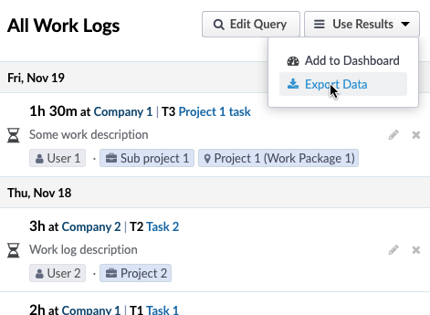
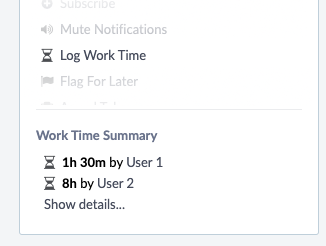

# :hourglass: Phixator 2

Task Work Log extension for Phabricator / Phorge

## Screenshots
|  |  |
| - | - |

## Features

 - Log hours of work on Maniphest tasks with the spent time, description and date of the work
 - Show the list of work logs, filtered by users, projects, spaces, tasks or time periods
 - Embed work log queries in Dashboards, with choice of displayed information
 - Export your query results in .csv, .json, .txt
 - French translation

## Installation

1. Clone or unzip this repository in the extensions folder of Phabricator in your server (`phabricator/src/extensions`)
2. Browse the application in Phabricator (`your-url.com/phixator`) - server restart may be needed
3. Subscribe/Watch this repository for new releases and bug fixes

## To do
- [ ] Time budgets

## Credits
Project originated by [4xxi](https://github.com/4xxi), updated by [ssnd292](https://github.com/ssnd292), rewritten by [motla](https://github.com/motla).

[MIT License](LICENSE)